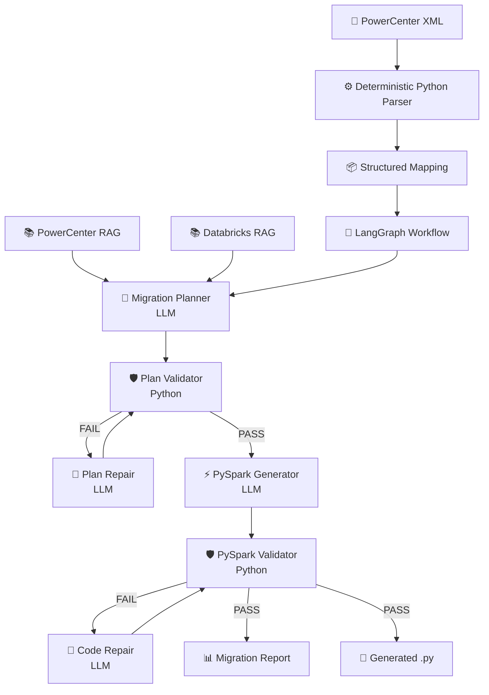
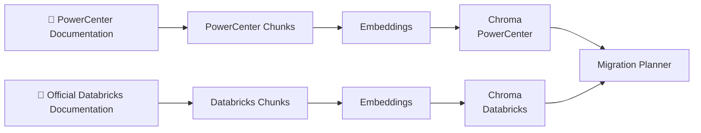
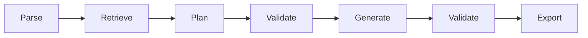
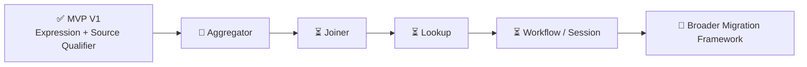

# 🤖 PowerCenter to Databricks Migration Agent


> Agentic AI system designed to assist the migration of **Informatica PowerCenter mappings to Databricks / PySpark**, combining deterministic parsing, dual RAG, LLM-based migration planning, validation, automatic repair loops and artifact generation.

---

## 🖼️ Project at a Glance


> **Note:** the architecture image above is an illustrative project diagram.
> No customer or production system is represented.

---

## 📑 Table of Contents

* [🚧 Project Status](#-project-status)
* [📌 Overview](#-overview)
* [🎯 What This Project Demonstrates](#-what-this-project-demonstrates)
* [🏗️ Architecture](#️-architecture)
* [🧰 Technologies](#-technologies)
* [⚙️ PowerCenter XML Parser](#️-powercenter-xml-parser)
* [📚 Dual RAG](#-dual-rag)
* [🧠 Migration Planner](#-migration-planner)
* [🛡️ Validation & Repair Loops](#️-validation--repair-loops)
* [🔧 Automatic Repair](#-automatic-repair)
* [💾 Persistent Caching](#-persistent-caching)
* [📊 Migration Artifacts](#-migration-artifacts)
* [🧠 Agentic Workflow](#-agentic-workflow)
* [🎯 Engineering Decisions](#-engineering-decisions)
* [📁 Repository Structure](#-repository-structure)
* [⚙️ Configuration](#️-configuration)
* [🧪 Quick Start with Synthetic Examples](#-quick-start-with-synthetic-examples)
* [🚀 Execution Flow](#-execution-flow)
* [🧪 Current MVP Coverage](#-current-mvp-coverage)
* [🗺️ Development Roadmap](#️-development-roadmap)
* [🔒 Portfolio & Data Privacy](#-portfolio--data-privacy)
* [⚠️ Disclaimer](#️-disclaimer)
* [👤 Let's Connect](#-lets-connect)

---

## 🚧 Project Status

This repository currently represents a **working MVP (Minimum Viable Product)** that is under **active development**.

The complete end-to-end workflow is already operational for the currently supported PowerCenter transformation patterns.

```text
PowerCenter XML
      ↓
Deterministic Parser
      ↓
Dual RAG
      ↓
Migration Planning
      ↓
Plan Validation / Repair
      ↓
PySpark Generation
      ↓
Code Validation / Repair
      ↓
Migration Report + .py artifacts
```

The current MVP supports:

* ✅ Source Qualifier
* ✅ Expression Transformation

Development is continuing with:

* 🚧 Aggregator
* ⏳ Joiner
* ⏳ Lookup
* ⏳ Workflow / Session parsing

The long-term objective is to progressively evolve the MVP into a broader **PowerCenter → Databricks migration framework**.

---

## 📌 Overview

Migrating legacy ETL workloads from Informatica PowerCenter to Databricks is not simply a code translation problem.

A migration engine needs to understand:

* sources and targets
* transformation types
* transformation expressions
* PowerCenter data flow
* transformation semantics
* environment-specific configuration
* equivalent Spark implementation patterns

A simple approach such as:

```text
PowerCenter XML
      ↓
     LLM
      ↓
   PySpark
```

can easily introduce hallucinated configuration, incorrect transformation semantics, invented paths or credentials and incomplete generated code.

This project therefore follows a different approach:

> **Use deterministic software where possible and LLM reasoning where useful.**

The LLM is part of the migration process, but it is **not treated as the source of truth**.

---

## 🎯 What This Project Demonstrates

* PowerCenter XML parsing
* Structured mapping extraction
* LangGraph workflow orchestration
* Retrieval-Augmented Generation
* Dual technical knowledge bases
* Local vector search with Chroma
* LLM-based migration planning
* Multi-provider LLM architecture
* Deterministic migration-plan validation
* Automatic plan repair
* Controlled PySpark generation
* Python AST validation
* PowerCenter semantic safeguards
* Structural completeness validation
* Automatic PySpark repair
* Persistent LLM-result caching
* Migration reporting
* Python artifact generation
* Human-in-the-loop migration design

---

## 🏗️ Architecture



The architecture deliberately separates **reasoning components** from **deterministic control components**.

| Component              | Responsibility                                         |
| ---------------------- | ------------------------------------------------------ |
| ⚙️ **Parser**          | Extract PowerCenter metadata and data flow             |
| 📚 **Dual RAG**        | Retrieve relevant PowerCenter and Databricks knowledge |
| 🧠 **Planner**         | Design the migration strategy                          |
| 🛡️ **Plan Validator** | Detect speculative or unsupported decisions            |
| 🔧 **Plan Repair**     | Correct failed migration plans                         |
| ⚡ **Generator**        | Produce PySpark                                        |
| 🛡️ **Code Validator** | Validate syntax, semantics and completeness            |
| 🔧 **Code Repair**     | Repair failed generated mappings                       |
| 📊 **Artifacts**       | Produce migration report and Python files              |

---

## 🧰 Technologies

| Technology                | Usage                                            |
| ------------------------- | ------------------------------------------------ |
| **Python**                | Parsing, validation, orchestration and utilities |
| **LangGraph**             | Deterministic agent workflow                     |
| **LangChain**             | LLM and retrieval integrations                   |
| **Chroma**                | Local vector database                            |
| **Sentence Transformers** | Local document embeddings                        |
| **PySpark**               | Migration target                                 |
| **Databricks**            | Target data platform                             |
| **Groq**                  | Hosted planner LLM                               |
| **OpenRouter**            | Hosted generator LLM / model routing             |
| **Ollama**                | Optional local LLM execution                     |
| **LangSmith**             | Optional agent tracing                           |
| **uv**                    | Python dependency and environment management     |
| **Git / GitHub**          | Version control and portfolio delivery           |

---

## ⚙️ PowerCenter XML Parser

The first stage is completely deterministic.

```text
PowerCenter XML
        ↓
ElementTree Parser
        ↓
Structured Python representation
```

The parser extracts information including:

* repositories
* folders
* mappings
* sources
* source fields
* targets
* target fields
* transformations
* transformation fields
* expressions
* instances
* connectors
* data flow

This avoids sending a large raw XML document directly to the LLM.

Instead:

```text
Raw XML
   ↓
Parser
   ↓
Structured facts
   ↓
LLM reasoning
```

The structured mapping remains the **source of truth throughout the workflow**.

---

## 📚 Dual RAG

The migration agent uses two independent technical knowledge bases.



### PowerCenter Knowledge Base

PowerCenter documentation is processed locally:

```text
Documentation
     ↓
UnstructuredLoader
     ↓
Page grouping
     ↓
Text splitting
     ↓
Embeddings
     ↓
Chroma
```

### Databricks Knowledge Base

Official Databricks documentation is ingested and indexed locally:

```text
Official documentation
       ↓
HTML ingestion
       ↓
Cleaning
       ↓
Chunking
       ↓
Embeddings
       ↓
Chroma
```

At runtime, the workflow queries the persisted vector stores instead of repeatedly processing the original documentation.

The current embedding model is:

```text
sentence-transformers/all-MiniLM-L6-v2
```

with **384-dimensional embeddings**.

---

## 🧠 Migration Planner

The planner receives three main sources of information:

```text
Structured PowerCenter Mapping
              +
     PowerCenter RAG
              +
      Databricks RAG
              ↓
       Migration Plan
```

The PowerCenter mapping remains authoritative.

Retrieved documentation provides technical knowledge but must not introduce mapping-specific behavior that does not exist in the parsed source.

Unknown information is explicitly treated as unresolved.

```text
Known mapping fact
       ↓
FACT

Required migration behavior
       ↓
MIGRATION REQUIREMENT

Missing information
       ↓
UNRESOLVED
```

---

## 🛡️ Validation & Repair Loops

One of the core design decisions of the project is that **LLM output is never automatically trusted**.

Two validation layers exist.

### Migration Plan Validation

```text
Migration Plan
      ↓
Validator
   ↙      ↘
PASS     FAIL
          ↓
       Repair
          ↓
       Validate
```

The validator detects speculative decisions such as:

* invented file formats
* invented storage paths
* assumed write modes
* unsupported transformation semantics
* environment-specific assumptions

### PySpark Validation

Generated PySpark passes through several deterministic checks.

```text
Generated PySpark
        ↓
Python Syntax
        ↓
Semantic Safeguards
        ↓
Source / Target Checks
        ↓
Structural Completeness
        ↓
PASS / REPAIR
```

Validation includes:

* Python AST parsing
* PowerCenter-specific semantic safeguards
* unresolved source configuration detection
* unresolved target configuration detection
* SETVARIABLE preservation
* invented write-mode detection
* invented path detection
* structural truncation detection

---

## 🔧 Automatic Repair

When validation fails, the entire migration is not regenerated.

Only the failed mapping is repaired.

```text
Mapping A ── PASS ───────────────┐
Mapping B ── PASS ───────────────┤
Mapping C ── FAIL → Repair → PASS├──→ Artifacts
Mapping D ── PASS ───────────────┤
Mapping E ── PASS ───────────────┘
```

The repair agent receives:

* current generated output
* deterministic validation violations
* migration plan
* structured mapping context

Repair attempts are bounded to avoid uncontrolled LLM loops.

---

## 💾 Persistent Caching

LLM results are persisted locally.

```text
Migration Plan
      ↓
Persistent Cache

Generated PySpark
      ↓
Persistent Cache
```

If a workflow contains five mappings and only one requires regeneration or repair, previously successful mappings can be reused.

This reduces:

* LLM API calls
* execution time
* token usage
* cost
* unnecessary output variation

---

## 📊 Migration Artifacts

The final stage produces:

```text
data/output/
│
├── migration_report.json
│
└── generated/
    ├── mapping_1.py
    ├── mapping_2.py
    └── ...
```

The migration report contains information such as:

```json
{
  "overall_status": "READY_WITH_UNRESOLVED_ITEMS",
  "migration_plan_validation_passed": true,
  "code_validation_passed": true,
  "mapping_count": 1,
  "mappings": [
    {
      "mapping_name": "example_mapping",
      "status": "READY_WITH_UNRESOLVED_ITEMS",
      "plan_validation": "PASSED",
      "code_validation": "PASSED",
      "unresolved_items": [
        "Source connection configuration is unresolved.",
        "Target file configuration is unresolved."
      ]
    }
  ]
}
```

Possible statuses include:

| Status                           | Meaning                                             |
| -------------------------------- | --------------------------------------------------- |
| 🟢 `READY`                       | Validation passed                                   |
| 🟡 `READY_WITH_UNRESOLVED_ITEMS` | Validation passed but human input is still required |
| 🔴 `FAILED_VALIDATION`           | Migration failed deterministic validation           |

---

## 🧠 Agentic Workflow

The project does not rely on an autonomous agent freely deciding which tools to execute.

Instead, **LangGraph explicitly controls the migration workflow**.



Conditional edges activate repair paths only when validation fails.

This makes the agentic workflow more predictable and easier to test.

---

## 🎯 Engineering Decisions

**Parser before LLM.**
PowerCenter XML is converted into structured facts before reasoning begins.

**Dual RAG instead of model memory alone.**
PowerCenter and Databricks technical knowledge is retrieved from dedicated knowledge bases.

**Structured mapping is the source of truth.**
Documentation can explain technology semantics but cannot invent mapping behavior.

**LLMs reason; Python validates.**
Planning and generation use LLMs, while critical acceptance checks remain deterministic.

**Unknown means unresolved.**
Missing configuration is surfaced explicitly instead of being replaced with plausible-looking values.

**Repair instead of full regeneration.**
Only mappings that fail deterministic validation are sent through the repair loop.

**Persistent checkpoints reduce unnecessary calls.**
Successful intermediate results survive later failures and can be reused.

**Provider independence.**
Planner and generator can use different LLM providers.

---

## 📁 Repository Structure

```text
powercenter-to-databricks-agent/
│
├── src/
│   ├── parser/
│   ├── rag/
│   ├── agent/
│   │   ├── nodes/
│   │   ├── prompts/
│   │   └── context/
│   ├── llm/
│   └── storage/
│
├── tests/
│
├── examples/
│   ├── README.md
│   ├── m_demo_customer_enrichment.xml
│   ├── m_demo_order_classification.xml
│   └── m_demo_product_normalization.xml
│
├── data/
│   ├── input/
│   ├── docs/
│   ├── vectorstore/
│   └── output/
│
├── docs/
│   └── images/
│
├── .env.example
├── .gitignore
├── pyproject.toml
└── README.md
```

The `examples/` directory contains **synthetic public mappings**.

The `data/` directories contain local runtime data and are intentionally excluded from the public repository where appropriate.

---

## ⚙️ Configuration

Create a local `.env` from the provided example.

### Windows PowerShell

```powershell
Copy-Item .env.example .env
```

### Linux / macOS

```bash
cp .env.example .env
```

Example configuration:

```dotenv
# Planner
PLANNER_LLM_PROVIDER=groq
PLANNER_LLM_MODEL=openai/gpt-oss-120b

# Generator
GENERATOR_LLM_PROVIDER=openrouter
GENERATOR_LLM_MODEL=openrouter/free

# API Keys
GROQ_API_KEY=
OPENROUTER_API_KEY=
OPENAI_API_KEY=

# LangSmith
LANGSMITH_TRACING=false
LANGSMITH_ENDPOINT=https://eu.api.smith.langchain.com
LANGSMITH_API_KEY=
LANGSMITH_PROJECT=powercenter-to-databricks-agent
```

Supported LLM providers currently include:

* Groq
* OpenRouter
* OpenAI
* Ollama

Planner and generator can use different providers.

---

## 🧪 Quick Start with Synthetic Examples

The repository includes synthetic PowerCenter XML mappings that can be used to explore and test the migration workflow without requiring access to real PowerCenter projects.

```text
examples/
│
├── m_demo_customer_enrichment.xml
├── m_demo_order_classification.xml
└── m_demo_product_normalization.xml
```

All examples are fictional and contain **no customer data, production metadata, credentials, internal infrastructure or proprietary mappings**.

### Available Examples

| Example                            | Transformations               | Purpose                                      |
| ---------------------------------- | ----------------------------- | -------------------------------------------- |
| `m_demo_customer_enrichment.xml`   | Source Qualifier + Expression | Customer name normalization and segmentation |
| `m_demo_order_classification.xml`  | Source Qualifier + Expression | Order classification based on amount         |
| `m_demo_product_normalization.xml` | Source Qualifier + Expression | Product-name normalization                   |

### 1. Choose an Example

For example:

```text
examples/m_demo_customer_enrichment.xml
```

### 2. Copy It to the Local Input Directory

Windows PowerShell:

```powershell
Copy-Item examples/m_demo_customer_enrichment.xml data/input/
```

Linux / macOS:

```bash
cp examples/m_demo_customer_enrichment.xml data/input/
```

The separation is intentional:

```text
examples/
    ↓
Synthetic public mappings
    ↓
Tracked by Git


data/input/
    ↓
Local migration inputs
    ↓
Ignored by Git
```

### 3. Configure the LLM Providers

Copy `.env.example` to `.env` and provide the API keys required by the providers you want to use.

For the default configuration:

```dotenv
PLANNER_LLM_PROVIDER=groq
GENERATOR_LLM_PROVIDER=openrouter

GROQ_API_KEY=your_key_here
OPENROUTER_API_KEY=your_key_here
```

> Never commit the local `.env` file.

### 4. Run the Migration Workflow

From the project root:

```powershell
uv run python -m src.agent.main
```

The synthetic mapping passes through the same end-to-end migration workflow:

```text
Synthetic PowerCenter XML
          ↓
        Parser
          ↓
   Structured Mapping
          ↓
       Dual RAG
          ↓
   Migration Planner
          ↓
Plan Validation / Repair
          ↓
   PySpark Generator
          ↓
Code Validation / Repair
          ↓
Migration Report + .py
```

### 5. Inspect the Generated Artifacts

After execution, generated artifacts are written locally under:

```text
data/output/
│
├── migration_report.json
│
└── generated/
    └── <mapping_name>.py
```

The generated Python file contains the proposed PySpark migration, while `migration_report.json` describes validation status and any unresolved information requiring human input.

> **Note:** `data/input/`, `data/output/`, `data/docs/` and `data/vectorstore/` are intentionally excluded from Git. The XML mappings under `examples/` are synthetic public examples created specifically for demonstrating the project.

---

## 🚀 Execution Flow

```text
1. Parse PowerCenter XML
2. Identify transformations
3. Retrieve PowerCenter documentation
4. Retrieve Databricks documentation
5. Build migration plans
6. Validate migration plans
7. Repair invalid plans when required
8. Generate PySpark
9. Validate generated code
10. Repair failed mappings when required
11. Generate migration report
12. Export Python artifacts
```

Run the project from the repository root:

```powershell
uv run python -m src.agent.main
```

Run the test suite:

```powershell
uv run pytest
```

---

## 🧪 Current MVP Coverage

| Capability                 | Status |
| -------------------------- | :----: |
| PowerCenter XML Parser     |    ✅   |
| Source Qualifier           |    ✅   |
| Expression Transformation  |    ✅   |
| Dual RAG                   |    ✅   |
| Migration Planner          |    ✅   |
| Plan Validator             |    ✅   |
| Plan Repair Loop           |    ✅   |
| PySpark Generator          |    ✅   |
| Python Syntax Validator    |    ✅   |
| Semantic Validator         |    ✅   |
| Structural Validator       |    ✅   |
| PySpark Repair Loop        |    ✅   |
| Persistent Cache           |    ✅   |
| Migration Report           |    ✅   |
| `.py` Artifact Export      |    ✅   |
| Aggregator                 |   🚧   |
| Joiner                     |    ⏳   |
| Lookup                     |    ⏳   |
| Workflow / Session Parsing |    ⏳   |

The current repository is therefore a **working end-to-end MVP**, not the final version of the migration framework.

Development is actively continuing.

---

## 🗺️ Development Roadmap



### Near-term

* Aggregator Transformation
* Joiner Transformation
* Lookup Transformation
* transformation-specific parser tests
* transformation-specific validators
* additional synthetic PowerCenter examples

### Future

Potential future development includes:

* workflow and session parsing
* broader PowerCenter transformation coverage
* richer expression translation
* migration confidence scoring
* automated migration testing
* improved retrieval strategies
* richer migration reports
* Databricks-native execution
* Databricks Vector Search integration

The goal is to progressively evolve the current MVP into a broader migration framework while preserving the same controlled architecture.

---

## 🔒 Portfolio & Data Privacy

This repository is intended as a **public technical portfolio project**.

Real migration environments may contain sensitive or proprietary information.

The public repository therefore excludes:

```text
.env
data/input/
data/docs/
data/vectorstore/
data/output/
```

These directories may contain:

* real PowerCenter XML exports
* internal source/target metadata
* proprietary documentation
* internal database names
* credentials and API keys
* local vector databases
* generated migration artifacts

Public demonstrations use **synthetic PowerCenter mappings and fictional infrastructure**.

No real customer credentials, production paths or confidential business data should be committed to this repository.

---

## ⚠️ Disclaimer

This project is an **independent experimental migration assistant under active development**.

It is not an official Informatica or Databricks product and is not affiliated with or endorsed by Informatica or Databricks.

The current repository represents a **working MVP**, not a production-ready automatic migration solution.

Generated migration plans and PySpark code must be reviewed and tested before use in production environments.

---

## 👤 Let's Connect

**Antonio Fiumanó**
Data Engineer | Databricks | PySpark | Data Integration | Agentic AI

🌐 **Portfolio:** [Visit my website](https://tonyfiuma.github.io/)
💼 **LinkedIn:** [Connect with me on LinkedIn](https://www.linkedin.com/in/antonio-f-68aab419a/)
💻 **GitHub:** [TonyFiuma](https://github.com/TonyFiuma)

---

⭐ If you found this project interesting, feel free to explore my portfolio and other Data Engineering & AI projects.

Have a project, opportunity, or just want to connect?

📩 **[Send me an email](mailto:axelfiumano@gmail.com)**
